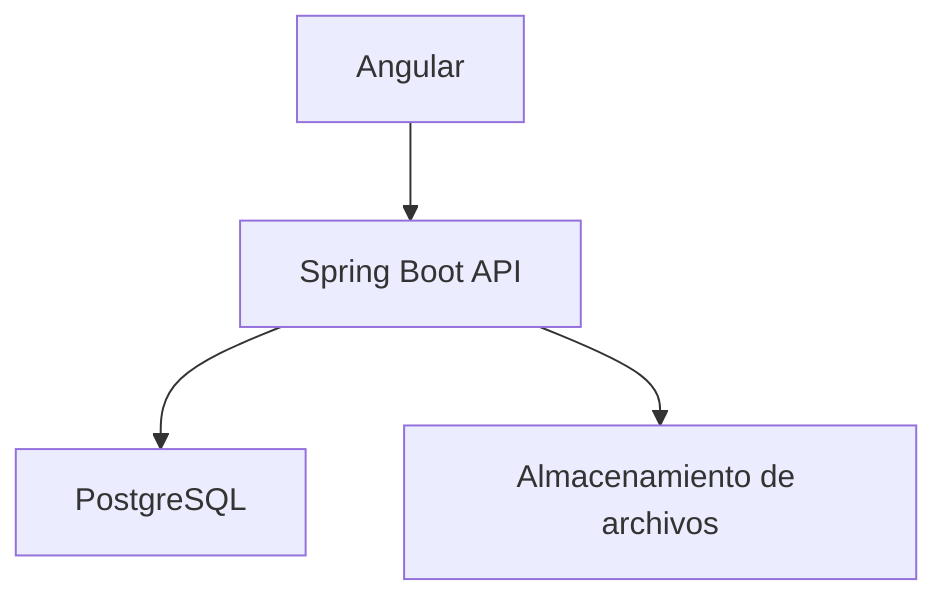
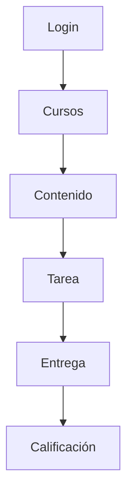

# Taller_3_JEE

- Crear una app en batch que cargue la B. D con el contenido de un curso de Estructuras de Datos. El curos estar cargada de [36 clases] [34 clases] en donde cada clase tiene sus propios recursos de su propio tema.
- Crear una app en batch que cargue la base de datos con el contenido de un curso de Estructuras de Datos. El curso estará cargado con 36 clases, en donde cada clase tiene sus propios recursos relacionados con su tema.
Los recursos de cada clase pueden ser:

1.Texto-html
2.Documentos
    -word
    -pdf
    -excel
    -ect
3.presentaciones
    -pptx
    -pdf
    -etc
4.Videos
5.imagenes
    -png
    -jpg
6.Enlacer URL
7.Animaciones

y otros posbiles tipos de archivos.


- Crear “simular” el desarrollo de un curso de E. D( estructura de datos) para un estudiante.
 - Simular el desarrollo de un curso de Estructura de Datos para un estudiante.
 El estudiante puede acceder al contenido de las clases guardadas en la base de datos desde la web.

- Generar un módulo de recomendaciones que de acuerdo al avance del estudiante guardado en la base de datos, le sugiera el tema siguiente o los refuerzos q estan dentro de la bd.

El avance del estudiante se puede se ve evidenciado en la nota que recibe de la evaluacion de una clase ya vista, trabajos entregados, si el trabajo fue entragado a timepo, tarde o no entrago.

- Realizar el diseño A. S y diseño detallado.
 - Realizar el diseño arquitectónico y el diseño detallado.
 El diseño debe contener como mínimo:
1. diseño de la Logica en donde el back utilizara Springboot 
2. diseño el desarrollo 
3. diseño de procesos
4. diseño de despliegue
5. diagrama 4+1(diagrama de escenario) 
- la presentacion sera mediante web, en donde se podra usar JSF Angular o react.
 - La presentación será mediante web; se podrá usar JSF, Angular o React.
## Seccion nueava a desarrollar

Se requiere el desarrollo de una aplicación en .NET encargada de consumir mensajes desde una cola de mensajería. Inicialmente, esta solución se implementará como una aplicación de consola, la cual se conectará a la cola, procesará los mensajes recibidos y los almacenará de forma persistente en una base de datos mediante el uso de Entity Framework.

Adicionalmente, se deben implementar funcionalidades de consulta que permitan filtrar los mensajes por tipo, con el fin de generar estadísticas y facilitar el análisis de la información almacenada.

El sistema debe garantizar la interoperabilidad e integración entre distintas aplicaciones, permitiendo el intercambio de información a través de la arquitectura definida.

Asimismo, se requiere habilitar la conexión directa de usuarios hacia el servicio desarrollado en .NET, asegurando el acceso a las operaciones expuestas por la aplicación.

El uso y acceso del usuario a el modulo de .net se implemetara mediante terminal, aqui se realiza todas las interacciones de esta seccion

Como parte del rediseño del sistema, se reemplaza el módulo anterior encargado de extraer mensajes y enviarlos por correo electrónico, por un nuevo componente en .NET cuya responsabilidad es el almacenamiento de dichos mensajes en la base de datos.


#  Plataforma Académica LMS

Sistema web para la gestión de cursos, contenido educativo, tareas y calificaciones.

---

##  Stack tecnológico

* **Frontend:** Angular
* **Frontend:** Angular
* **Backend:** Spring Boot
* **Base de datos:** PostgreSQL

---

##  Funcionalidades principales

* Inscripción de estudiantes
* Publicación de contenido por clase
* Creación de tareas
* Entrega de trabajos
* Calificación de entregas

---

##  Roles

* **Alumno**

  * Ver cursos inscritos
  * Consumir contenido
  * Entregar tareas
  * Consultar calificaciones

* **Docente**

  * Crear y gestionar cursos
  * Publicar contenido
  * Crear tareas
  * Calificar entregas

* **Administrador**

  * Gestión de usuarios y control del sistema

---

##  Arquitectura



---

##  Modelo de datos

### Entidades

* `USUARIO`
* `CURSO`
* `INSCRIPCION`
* `CONTENIDO`
* `TAREA`
* `ENTREGA`

---

##  Relaciones
Se mantienen las siguientes relaciones principales entre entidades:

- `USUARIO` 1--* `INSCRIPCION` (un usuario puede realizar varias inscripciones)
- `CURSO` 1--* `INSCRIPCION` (un curso recibe varias inscripciones)
- `USUARIO` 1--* `CURSO` (un usuario docente puede crear varios cursos)
- `CURSO` 1--* `CONTENIDO` (un curso contiene varios contenidos)
- `CURSO` 1--* `TAREA` (un curso incluye varias tareas)
- `TAREA` 1--* `ENTREGA` (una tarea recibe varias entregas)
- `USUARIO` 1--* `ENTREGA` (un alumno puede realizar varias entregas)

---

##  Estructura de contenido

Entidad flexible `CONTENIDO`:

* `tipo`: VIDEO | PRESENTACION | DOCUMENTO | PDF | ENLACE | IMAGEN
* `url`: recurso asociado
* `orden`: secuencia dentro del curso

Permite que cada clase tenga un formato diferente.

---

##  Flujo principal



---

##  Estructura del backend

```text
src/
├─ config/
├─ security/
├─ controllers/
├─ services/
├─ repositories/
├─ entities/
├─ dtos/
└─ exceptions/
```

##  Reglas clave

* Un alumno solo accede a cursos inscritos
* Un docente solo gestiona sus cursos
* Las tareas tienen fecha límite
* Cada entrega pertenece a un alumno y una tarea
* Solo el docente puede calificar

