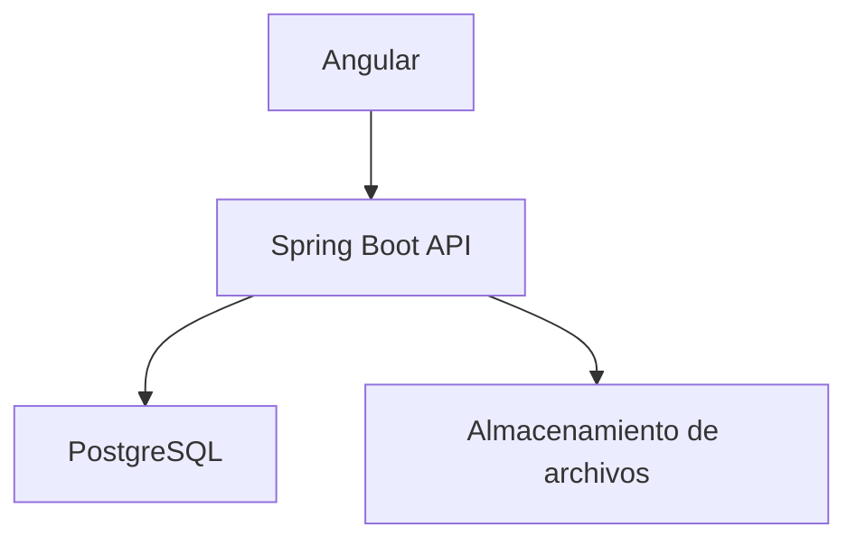
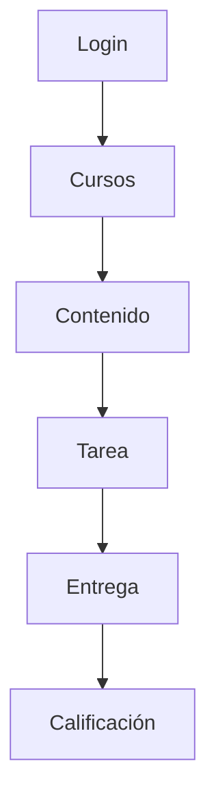

# Taller_3_JEE

- Crear una app en batch que cargue la B. D con el contenido de un curso de Estructuras de Datos. El curos estar cargada de [36 clases] [34 clases] en donde cada clase tiene sus propios recursos de su propio tema.
Los recursos de cada clase pueden ser:

1.Texto-html
2.Documentos
    -word
    -pdf
    -excel
    -ect
3.presentaciones
    -pptx
    -pdf
    -etc
4.Videos
5.imagenes
    -png
    -jpg
6.Enlacer URL
7.Animaciones

y otros posbiles tipos de archivos.

- No incluir nada de Login en esta entrega, es sólo una visión por encima de front y traer información de la base de datos.

- Crear “simular” el desarrollo de un curso de E. D( estructura de datos) para un estudiante.
El estudiante puede acceder al contenido de las clases guardadas en la bd desde la web 

- Generar un módulo de recomendaciones que de acuerdo al avance del estudiante guardado en la base de datos, le sugiera el tema siguiente o los refuerzos q estan dentro de la bd.

El avance del estudiante se puede se ve evidenciado en la nota que recibe de la evaluacion de una clase ya vista, trabajos entregados, si el trabajo fue entragado a timepo, tarde o no entrago.


- Realizar el diseño A. S y diseño detallado.
EL diseño debe contener como minimo:
1. diseño de la Logica en donde el back utilizara Springboot 
2. diseño el desarrollo 
3. diseño de procesos
4. diseño de despliegue
5. diagrama 4+1(diagrama de escenario) 
- la presentacion sera mediante web, en donde se podra usar JSF Angular o react.

#  Plataforma Académica LMS

Sistema web para la gestión de cursos, contenido educativo, tareas y calificaciones.

---

##  Stack tecnológico

* **Frontend:** Angular
* **Backend:** Spring Boot
* **Base de datos:** PostgreSQL

---

##  Funcionalidades principales

* Inscripción de estudiantes
* Publicación de contenido por clase
* Creación de tareas
* Entrega de trabajos
* Calificación de entregas

---

##  Roles

* **Alumno**

  * Ver cursos inscritos
  * Consumir contenido
  * Entregar tareas
  * Consultar calificaciones

* **Docente**

  * Crear y gestionar cursos
  * Publicar contenido
  * Crear tareas
  * Calificar entregas

* **Administrador**

  * Gestión de usuarios y control del sistema

---

##  Arquitectura



---

##  Modelo de datos

### Entidades

* `USUARIO`
* `CURSO`
* `INSCRIPCION`
* `CONTENIDO`
* `TAREA`
* `ENTREGA`

---

##  Relaciones

```mermaiderDiagram
    USUARIO ||--o{ INSCRIPCION : realiza
    CURSO ||--o{ INSCRIPCION : recibe
    USUARIO ||--o{ CURSO : crea
    CURSO ||--o{ CONTENIDO : contiene
    CURSO ||--o{ TAREA : incluye
    TAREA ||--o{ ENTREGA : recibe
    USUARIO ||--o{ ENTREGA : realiza
```

---

##  Estructura de contenido

Entidad flexible `CONTENIDO`:

* `tipo`: VIDEO | PRESENTACION | DOCUMENTO | PDF | ENLACE | IMAGEN
* `url`: recurso asociado
* `orden`: secuencia dentro del curso

Permite que cada clase tenga un formato diferente.

---

##  Flujo principal



---

##  Estructura del backend

```text
src/
├─ config/
├─ security/
├─ controllers/
├─ services/
├─ repositories/
├─ entities/
├─ dtos/
└─ exceptions/
```

##  Reglas clave

* Un alumno solo accede a cursos inscritos
* Un docente solo gestiona sus cursos
* Las tareas tienen fecha límite
* Cada entrega pertenece a un alumno y una tarea
* Solo el docente puede calificar

